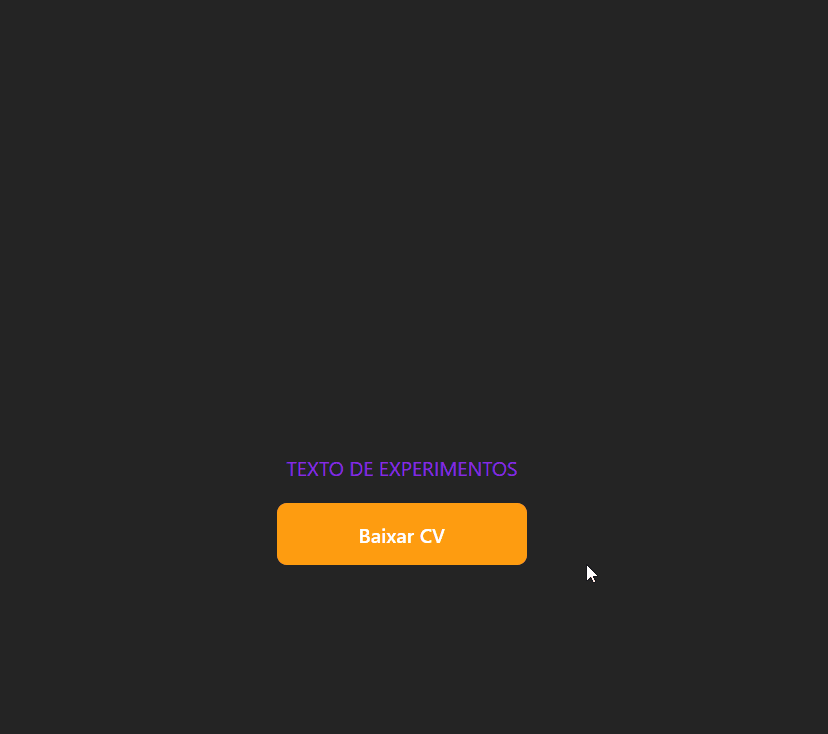

# Projeto React Base

## Descrição

Projeto criado pra praticar conceitos básicos do React, como uso de props e dos componentes.

## Desafio

1. Criar um componente que colore e transforma um texto para maiúsculo (uppercase) utilizando JS.

2. Criar um componente Button com um evento de clique que apresenta um alerta informando a prop label do botão.

## Como rodar o projeto

1. Clone o repositório
2. Instale as dependências com `npm install`
3. Inicie com `npm run dev`

## Tecnologias utilizadas

- HTML
- CSS
- JavaScript
- Vite

### Bibliotecas utilizadas

- React
- PropTypes

## Autor

Vitor da Rosa - [Github](https://github.com/vtuRose)
